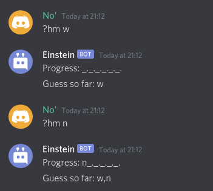
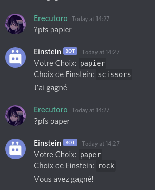
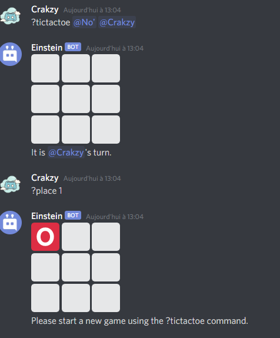

# __NOTRE BOT EINSTEIN__
Bot discord multi-fonctionalité

# Libraries
- random
- asyncio
- youtube_dl
- [discord.py](https://github.com/Rapptz/discord.py)

Pré-requis: Python 3.0+.

# Que fait notre bot ?
- Met de la musique
- Donne des conseils sur des jeux multi
- Pierre feuille ciseaux, morpion, devine le mot
- 3 langues: Francais, Anglais, Espagnol

# Exemple:

